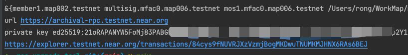
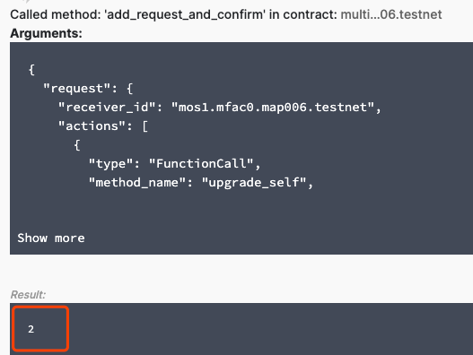

# MCS Upgrade Tool

A tool for multisig member to add "upgrade MCS contract" request and confirm it.

## Table of Contents

- [Pre-requisite](#pre-requisite)
- [How to Build](#how-to-build)
- [Usage](#usage)


## Pre-requisite

**Go (version 1.18 or later)**

Go are available at the [Go installation page](https://go.dev/doc/install) and necessary bundles can be downloaded from the [Go download page](https://go.dev/dl/).


## How to Build
```shell
git clone https://github.com/PandaRR007/mcs-upgrade-tool.git
cd mcs-upgrade-tool
make
```

You can see a binary **mcs-upgrade-tool** is generated.

## Usage

1. Configure upgrade.json
```json
{
  "nearRpcUrl": "https://archival-rpc.testnet.near.org",  
  "sender": "member1.map002.testnet",                     
  "senderPrivateKey": "ed25519:...",                       
  "multisigAccount": "multisig.mfac.map004.testnet",      
  "mcsAccount": "mos2.mfac.map004.testnet",              
  "mcsWasmFile": "/path/to/mcs.wasm"                     
}
```
* **nearRpcUrl**: near rpc url
* **sender**: multisig member account to add the request
* **senderPrivateKey**: private key of the multisig member
* **multisigAccount**: multisig contract account
* **mcsAccount**: MCS contract account to be upgraded
* **mcsWasmFile**: MCS contract wasm file to upgrade the MCS contract


2. Execute upgrade command

```shell
./mcs-upgrade-tool upgrade
```

3. Get the request ID

After the command is executed successfully, you can see a NEAR blockchain explorer link at the last line of the output.


Click it, and you can get the request ID from the transaction details.

